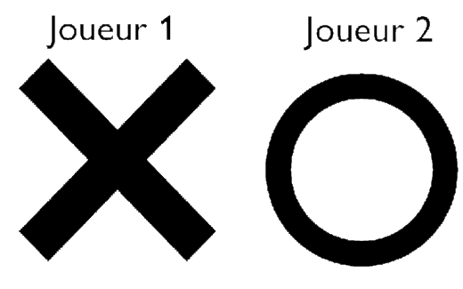
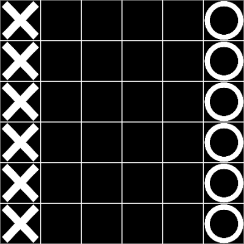
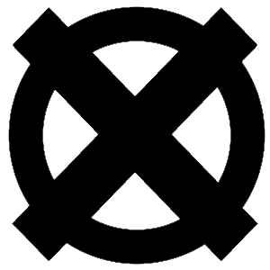
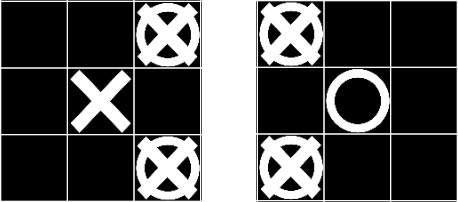
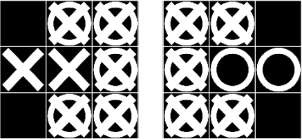
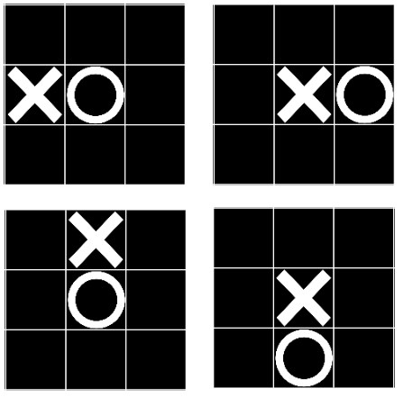
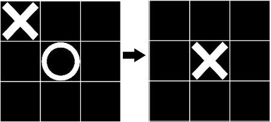

# Introduction
C'est un petit jeu de stratégie à 2 joueurs, fait en javascript, jouable [ici](https://deadmall0w.github.io/Mon-jeu-Internet/)

# Regles
## Introduction
Voici les règles de mon jeu:
Il se joue à 2, le premier joueur est représenté par un 'X' et le deuxième par un 'O'.

Le jeu se déroule en tour par tour sur une grile de taille variable.
Les joueurs débutent de chaque côtés du plateau.

 
### But
Le but est de coincé ou capturer tous les pions adverses en déplaçant les pions de façon statégique.

## Début de partie
Une partie est répartie en manches.
- Lors des manches pairs, c'est le joueur X qui commence.
- Lors des manches impairs, c'est le joueur O qui commence.

Le joueur ayant remporté le plus de manches ressort vainqueur.

## Jouabilité
Lorsque c'est notre tour, en cliquant sur un pion, les mouvements possibles sont affichés par une croix et un rond superposé.

Pour déplacer le pion, il suffit de rester appuyé dessus et de le glisser vers la case suivante. Attention, si un mouvement n'est pas valide, le pion ne bouge pas.

## Mouvements
### Base
Les pions peuvent avancer uniquement vers l'avant et en diagonales. Mais lorsque deux pions du même camp sont l'un devant l'autre, le pion arrière peut se déplacer tout autour du pion allié. En revanche, le pion devant garde les même mouvement qu'un pion seul.

### Pion bloqué
Un pion peut bloquer un autre pion et l'empêcher de bouger en étant autout. Le pion ne peut alors plus se déplacer.

> Ici, le pion X et le pion O sont bloqué car un pion ennemi les bloque, ils ne peuvent donc pas bouger.

### Pion capturé
Un pion peut être capturé quand un pion adverse se place au dessus de lui. Le pion capturé et ainsi perdu pour le reste de la manche.
 

> Ici, le pion X se déplace sur le pion O, capturant ainsi le pion O.

## Victoire
- Si un joueur n'a plus de pion, ou tous ces pions sont bloqué, il perd.
- Si les 2 joueurs sont bloqué, c'est celui qui a le plus de pion qui gagne.
- Si les 2 joueurs ont le même nombre de pion, il y a une égalité.

# Création

# License

 
